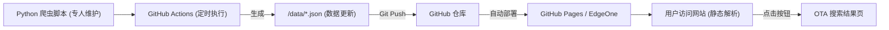

# 航价通 (Hangjiatong) - 技术架构与落地指南

## 1. 产品定位
**航价通 (fly.earfquake.online)** 是一个纯前端的特价机票聚合展示平台，定位为**决策辅助工具**而非 OTA。
核心价值链：
1. 发现值得看的特价票
2. 帮用户评估性价比（数据可视化、提供限制条件）
3. 协助决策后，引流跳转至下游真实 OTA 平台（如携程、飞猪、去哪儿）进行交易。

## 2. 总体架构设计

本项目采用**完全无服务器 (Serverless) 的前端 + 自动化脚本**架构，极大地降低了运维和服务器成本：



## 3. 项目目录说明

```text
hangjiatong/
├── index.html                   # 平台前端主框架 (SPA单页应用)
├── README.md                    # 对外项目说明
├── data/                        # 存放生成的数据
│   ├── deals.json               # 首页特价航班数据（由爬虫写入）
│   └── README.md
├── docs/                        # 项目内部文档
│   ├── API_DOCS.md              # 接口标准契约 (爬虫输出的 JSON 格式必须符合此文档)
│   ├── PROJECT_DOC.md           # 产品核心理念
│   └── IMPLEMENTATION.md        # 本技术落地档案 (即本文档)
├── scripts/                     # 后端爬虫代码 (纯脚本)
│   ├── crawl_deals.py           # 抓取逻辑的主入口模板
│   └── requirements.txt         # 爬虫的依赖库
└── .github/                     
    └── workflows/               
        └── update-data.yml      # CI/CD 自动化抓取跑批配置
```

## 4. 后端爬虫（专人）对接指南

当前前端预留了完全隔离的数据接口，后端同学不需要写服务型的后端 API（比如 Flask 或 SpringBoot）。只需要维护 `scripts/crawl_deals.py` 这一个抓取脚本即可。

### 4.1 数据更新流程
1. 爬虫脚本执行，爬取第三方接口（如 Kiwi Tequila）或解析部分公开航线页面。
2. 将清洗后的数据严格按照 `docs/API_DOCS.md` 里的数据结构规范组装。
3. 脚本执行结束前，将组装好的字典 / JSON 覆写保存到 `data/deals.json` 文件中。
4. GitHub Actions 会每 6 小时自动跑一次这个脚本，并自动把变动的 `deals.json` 提交到仓库。前端自动读取最新数据。

### 4.2 bookingUrl 生成策略
所有展示的数据卡片必须带上有效的外跳链接 `bookingUrl`。规则约束：
- 必须跳转到**携程、飞猪、去哪儿**等平台的**搜索结果页**。
- **不要求**直达具体的航班详情页（URL 含有 session 和鉴权签名，极容易失效）。

已知目前可用的免登陆 DeepLink 参数拼接模板（注意 URL 编码）：
- **去哪儿**：`https://flight.qunar.com/site/oneway_list.htm?searchDepartureAirport={出发城市中文}&searchArrivalAirport={到达城市中文}&searchDepartureTime={YYYY-MM-DD}`
- **飞猪**：`https://www.fliggy.com/redirect?type=5&searchQuery={出发城市中文}-{到达城市中文}&departDate={YYYY-MM-DD}`
- **携程**：`https://flights.ctrip.com/online/list/oneway-{出发地三字码}-{到达地三字码}?depdate={YYYY-MM-DD}`

## 5. 前端切换为线上数据模式

目前 `index.html` 处于测试预设的 Mock 模式。当后端同学的 `deals.json` 数据抓取脚本开发跑通之后，在 `index.html` 找到以下配置项：

```javascript
/* 核心配置总开关 */
const API_CONFIG = {
  USE_MOCK: true,      // 设为 false，停止使用假数据，转而加载同级目录的 JSON 数据
  BASE_URL: './data',  // 指向当前目录的 data 目录
};
```

将其改为 `USE_MOCK: false`，刷新页面即可直接渲染真实爬虫爬下来的机票。界面的加载动画、网络请求、容错报错逻辑均已在 JS 中全自动处理完成闭环。

---
*结语：依靠这套“自动爬虫 + 静态托管”机制，你的航价通项目将实现零后端常驻、一劳永逸的全自动信息流更新。*
